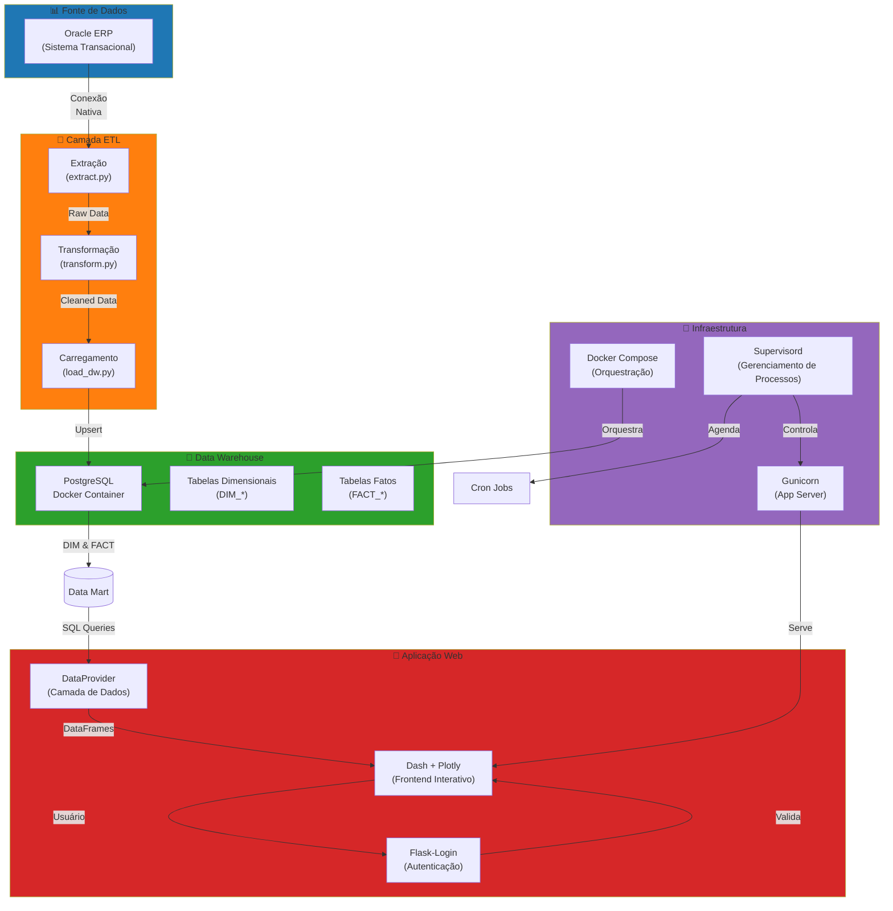
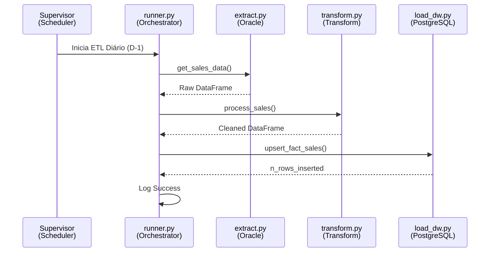
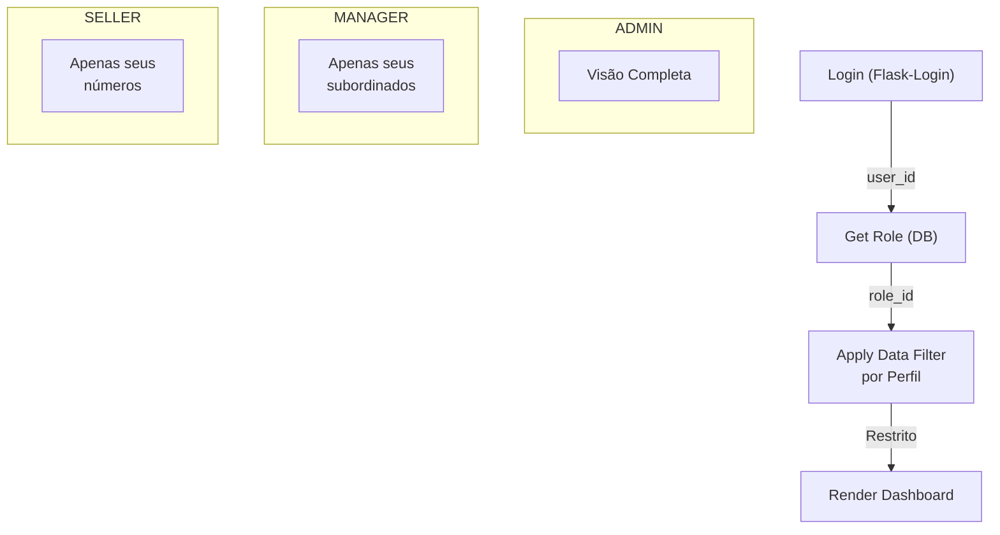
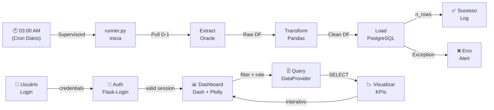

# 🏗️ Arquitetura Técnica — Dash Ticket Vendedor

## Visão Geral

Este documento descreve a arquitetura, decisões de design e padrões técnicos implementados no Dash Ticket Vendedor.

---

## 1. Visão Geral da Arquitetura



---

## 2. Stack Tecnológico

### Backend & ETL
- **Python 3.12**: Linguagem principal, com type hints modernos
- **Dash + Plotly**: Framework web reativo para dashboards interativos
- **Flask-Login**: Camada de autenticação stateful com sessões
- **oracledb**: Driver nativo para conexão com Oracle (sem ODBC)
- **pandas**: Transformação e processamento de dados
- **PostgreSQL**: Data warehouse relacional

### Infraestrutura
- **Docker & Docker Compose**: Containerização do PostgreSQL
- **Gunicorn**: Application Server WSGI para Dash
- **Supervisord**: Gerenciador de processos (serviços + cron jobs)
- **Linux systemd**: Serviços de inicialização e timers

---

## 3. Padrões Arquiteturais

### 3.1 Clean Architecture
O projeto segue camadas bem separadas:

```
src/
├── dashboard/          # Presentation Layer (UI/Callbacks)
├── data/
│   ├── data_provider.py  # Application Layer (Business Logic)
│   └── etl/              # Data Layer (Extraction & Loading)
└── shared/             # Utilities & Constants
```

**Benefícios:**
- Separação de responsabilidades clara
- Fácil de testar cada camada independentemente
- Baixo acoplamento entre módulos

### 3.2 ETL Pipeline Pattern
O pipeline segue o padrão clássico **Extract → Transform → Load**:



**Características:**
- **Idempotência**: Usa UPSERT em vez de INSERT (seguro para re-runs)
- **Logging Detalhado**: Rastreia cada inserção/atualização
- **Agendamento**: Executa daily D-1 via `supervisord`

### 3.3 Role-Based Access Control (RBAC)
Três camadas de autorização:



---

## 4. Camadas Principais

### 4.1 Frontend (Dash + Plotly)
**Arquivo Principal:** `src/dashboard/app.py`

**Responsabilidades:**
- Inicializar aplicação Dash
- Registrar callbacks (interatividade)
- Configurar Flask-Login
- Servir assets (CSS/JS)

**Padrão de Callbacks:**
```python
@app.callback(
    Output('kpi-card', 'children'),
    Input('filter-date', 'value'),
    State('user-id', 'data'),
    prevent_initial_call=True
)
def update_kpi(selected_date, user_id):
    data = data_provider.get_kpi_data(user_id, selected_date)
    return render_kpi_card(data)
```

### 4.2 Autenticação (Flask-Login)
**Arquivo Principal:** `src/dashboard/auth.py`

**Features:**
- Armazenamento de credenciais em PostgreSQL (hash bcrypt)
- Sessões stateful com cookies seguros
- Fallback hardcoded (`admin/admin123`) para recuperação
- Perfis armazenados no banco (ADMIN, MANAGER, SELLER)

**Fluxo:**
1. Usuário submete login
2. Validação contra tabela `dash_users`
3. Se válido → sessão criada
4. Cada requisição → middleware verifica sessão

### 4.3 Data Provider (Business Logic)
**Arquivo Principal:** `src/data/data_provider.py`

**Responsabilidades:**
- Queries otimizadas ao DW
- Aplicar filtros baseados em perfil
- Processar dados para visualização
- Cache em memória (quando apropriado)

**Exemplo:**
```python
def get_seller_performance(seller_id: int, start_date, end_date):
    # Query com WHERE restritivo
    query = f"""
    SELECT fact.*, dim_seller.name
    FROM fact_sales fact
    JOIN dim_seller ON fact.seller_id = dim_seller.id
    WHERE fact.seller_id = {seller_id}
    AND fact.date BETWEEN '{start_date}' AND '{end_date}'
    """
    return pd.read_sql(query, self.dw_conn)
```

### 4.4 ETL Pipeline
**Diretório:** `src/data/etl/`

**Componentes:**

| Arquivo | Responsabilidade |
|---------|------------------|
| `runner.py` | Orquestração e scheduling |
| `extract.py` | Conexão Oracle e extração raw |
| `transform.py` | Limpeza, validação e transformação |
| `load_dw.py` | UPSERT em PostgreSQL |
| `sql_ddl.py` | Criação de tabelas e índices |
| `sync_dimensions.py` | Sincronização de dimensões (SCD Type 1) |
| `sync_periods.py` | Calendário e períodos de relatório |

---

## 5. Decisões de Design

### 5.1 Por que PostgreSQL em vez de Oracle?
- **DW Dedicado**: Separa transacional (ERP) de analítico (DW)
- **Custo**: Sem licenças Oracle adicionais
- **Docker**: Fácil de replicar em múltiplos ambientes
- **Índices**: Otimizado para queries OLAP

### 5.2 Por que Dash em vez de Tableau/Power BI?
- **Código**: Tudo em Python (mesmo stack do ETL)
- **Customização**: Componentes React.js (Plotly) personalizados
- **Glassmorphism**: Design moderno sem bibliotecas pesadas
- **Sem Licenças**: Open source + escalável

### 5.3 Por que oracledb em vez de cx_Oracle?
- **Driver Nativo**: Sem dependência de Oracle Client libraries
- **Performance**: Mais rápido em grandes extrações
- **Modernidade**: Suportado oficialmente pela Oracle

### 5.4 Supervisord em vez de systemd apenas
- **Multi-processo**: Gerencia Gunicorn + cron ETL
- **Auto-restart**: Reinicia serviços em caso de crash
- **Logs Centralizados**: Stdout/stderr capturados

---

## 6. Fluxo de Dados Completo



---

## 7. Escalabilidade & Performance

### Cache
- **Cache em Memória**: DataFrames frequentemente acessados
- **TTL**: 5 minutos para dados de KPIs
- **Invalidação**: Manual após carga ETL

### Índices PostgreSQL
```sql
-- Índices em tabelas de fatos
CREATE INDEX idx_fact_sales_seller ON fact_sales(seller_id);
CREATE INDEX idx_fact_sales_date ON fact_sales(date_key);
CREATE INDEX idx_fact_sales_seller_date ON fact_sales(seller_id, date_key);
```

### Queries Otimizadas
- Projeção de colunas (nunca `SELECT *`)
- `WHERE` com índices
- JOINs via foreign keys
- Particionamento (se necessário em futuro)

---

## 8. Segurança

### Autenticação & Autorização
- ✅ Senhas com hash bcrypt
- ✅ Sessões stateful (Flask-Login)
- ✅ CSRF protection (via Dash)
- ✅ SQL Injection prevention (parameterized queries)

### Dados Sensíveis
- `.env` para credenciais (gitignore)
- Variáveis de ambiente apenas em runtime
- Acesso ao Oracle limitado a usuário específico

### Network
- Gunicorn em localhost (nginx como reverse proxy em produção)
- PostgreSQL em container isolado
- Firewall externo restringindo porta 8050

---

## 9. Testes

**Estrutura:**
```
tests/
├── unit/              # Testes isolados (formatters, auth)
├── integration/       # DataProvider + PostgreSQL
└── e2e/              # Dashboard + Callbacks
```

**Cobertura:**
- ✅ Autenticação (login/logout/roles)
- ✅ DataProvider (queries + filtros)
- ✅ ETL (extract/transform/load)
- ✅ Callbacks (interatividade)

---

## 10. Desenvolvimento & Debugging

### Setup Local
```bash
# 1. Virtual env
python3 -m venv venv
source venv/bin/activate

# 2. Dependências
pip install -r requirements.txt

# 3. PostgreSQL (docker)
docker-compose up -d

# 4. Migrations
python src/data/etl/sql_ddl.py

# 5. Run app
python -m src.dashboard.app
# Acesso: http://localhost:8050
```

### Logging
```python
import logging
log = logging.getLogger(__name__)
log.info("Evento importante")  # INFO
log.warning("Possível problema")  # WARNING
log.error("Erro crítico")  # ERROR
```

---

## 11. Roadmap Futuro

- [ ] GraphQL API (alternativa a REST)
- [ ] WebSockets para real-time updates
- [ ] Alertas automáticos via email/Slack
- [ ] Mobile app (React Native)
- [ ] Machine Learning para previsões
- [ ] Multi-tenancy (múltiplas empresas)

---

**Última atualização:** Maio 2026
