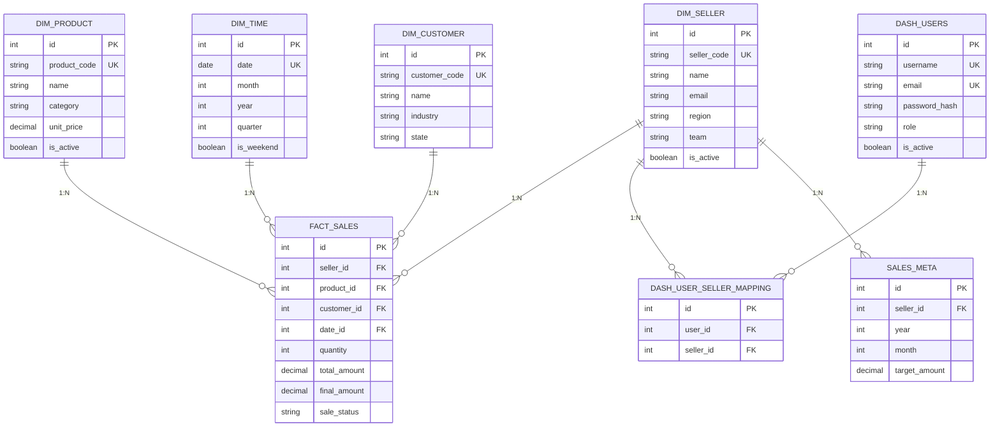

# 🗄️ Modelo de Dados — Dash Ticket Vendedor

Documentação do schema PostgreSQL utilizado no Data Warehouse.

---

## Visão Geral

O modelo segue um **esquema em estrela (Star Schema)** comum em Data Warehouses:

```
        ┌──────────────────┐
        │   FACT_SALES     │
        │   (Transações)   │
        └────────┬─────────┘
                 │
    ┌────────────┼────────────┬──────────────┐
    │            │            │              │
    ▼            ▼            ▼              ▼
┌────────────┐ ┌───────────┐ ┌──────────┐ ┌────────────┐
│DIM_SELLER  │ │DIM_PRODUCT│ │DIM_TIME  │ │DIM_CUSTOMER│
│            │ │           │ │          │ │            │
│PK: id      │ │PK: id     │ │PK: id    │ │PK: id      │
└────────────┘ └───────────┘ └──────────┘ └────────────┘
```

---

## 1. Tabelas de Dimensão (DIM_*)

### DIM_SELLER — Vendedores

```sql
CREATE TABLE dim_seller (
    id SERIAL PRIMARY KEY,
    seller_code VARCHAR(20) UNIQUE NOT NULL,
    name VARCHAR(150) NOT NULL,
    email VARCHAR(100),
    phone VARCHAR(20),
    region VARCHAR(50),
    team VARCHAR(50),
    hire_date DATE,
    is_active BOOLEAN DEFAULT true,
    created_at TIMESTAMP DEFAULT NOW(),
    updated_at TIMESTAMP DEFAULT NOW()
);
```

**Exemplo de Dados:**
```
id | seller_code | name           | email         | region | team
1  | SEL001      | João Silva     | joao@emp.com  | Sul    | Vendas
2  | SEL002      | Maria Santos   | maria@emp.com | Norte  | Vendas
3  | SEL003      | Carlos Lima    | carlos@emp.com| Centro | Gerência
```

---

### DIM_PRODUCT — Produtos

```sql
CREATE TABLE dim_product (
    id SERIAL PRIMARY KEY,
    product_code VARCHAR(50) UNIQUE NOT NULL,
    name VARCHAR(200) NOT NULL,
    category VARCHAR(50),
    subcategory VARCHAR(50),
    unit_price DECIMAL(10, 2),
    is_active BOOLEAN DEFAULT true,
    created_at TIMESTAMP DEFAULT NOW()
);
```

**Exemplo de Dados:**
```
id | product_code | name              | category     | unit_price
1  | PROD001      | Notebook Dell     | Eletrônicos  | 3500.00
2  | PROD002      | Mouse Logitech    | Acessórios   | 150.00
3  | PROD003      | Teclado Mecânico  | Acessórios   | 450.00
```

---

### DIM_TIME — Datas/Períodos

```sql
CREATE TABLE dim_time (
    id SERIAL PRIMARY KEY,
    date DATE UNIQUE NOT NULL,
    day_of_week INT,                  -- 1=Segunda ... 7=Domingo
    day_name VARCHAR(10),             -- "Monday", "Tuesday", ...
    day_of_month INT,
    month INT,                        -- 1-12
    month_name VARCHAR(10),           -- "January", ...
    quarter INT,                      -- 1-4
    year INT,
    is_weekend BOOLEAN,
    is_holiday BOOLEAN,
    created_at TIMESTAMP DEFAULT NOW()
);
```

**Exemplo de Dados:**
```
id   | date       | day_of_week | month_name | quarter | year | is_weekend
1000 | 2026-05-20 | 3           | May        | 2       | 2026 | false
1001 | 2026-05-21 | 4           | May        | 2       | 2026 | false
1002 | 2026-05-22 | 5           | May        | 2       | 2026 | false
1003 | 2026-05-23 | 6           | May        | 2       | 2026 | true
```

---

### DIM_CUSTOMER — Clientes

```sql
CREATE TABLE dim_customer (
    id SERIAL PRIMARY KEY,
    customer_code VARCHAR(50) UNIQUE NOT NULL,
    name VARCHAR(200) NOT NULL,
    industry VARCHAR(50),
    state VARCHAR(2),
    city VARCHAR(100),
    customer_type VARCHAR(20),        -- "Individual", "Company"
    is_active BOOLEAN DEFAULT true,
    created_at TIMESTAMP DEFAULT NOW()
);
```

**Exemplo de Dados:**
```
id | customer_code | name              | industry      | state | customer_type
1  | CUST001       | Empresa XYZ Ltd.  | Tecnologia    | SP    | Company
2  | CUST002       | João Pessoa      | Varejo        | RJ    | Individual
3  | CUST003       | Loja ABC          | Comércio      | MG    | Company
```

---

## 2. Tabela de Fatos (FACT_*)

### FACT_SALES — Transações de Vendas

```sql
CREATE TABLE fact_sales (
    id SERIAL PRIMARY KEY,
    
    -- Foreign Keys para Dimensões
    seller_id INT NOT NULL REFERENCES dim_seller(id),
    product_id INT NOT NULL REFERENCES dim_product(id),
    customer_id INT NOT NULL REFERENCES dim_customer(id),
    date_id INT NOT NULL REFERENCES dim_time(id),
    
    -- Métricas
    quantity INT NOT NULL,
    unit_price DECIMAL(10, 2) NOT NULL,
    total_amount DECIMAL(12, 2) NOT NULL,
    discount_percent DECIMAL(5, 2) DEFAULT 0,
    discount_amount DECIMAL(10, 2) DEFAULT 0,
    final_amount DECIMAL(12, 2) NOT NULL,
    
    -- Status
    sale_status VARCHAR(20) DEFAULT 'Completed',  -- Completed, Cancelled, Returned
    commission_percent DECIMAL(5, 2),
    commission_amount DECIMAL(10, 2),
    
    -- Auditoria
    created_at TIMESTAMP DEFAULT NOW(),
    updated_at TIMESTAMP DEFAULT NOW(),
    source_system VARCHAR(20) DEFAULT 'ERP'
    
    -- Índices para Performance
    -- CREATE INDEX idx_fact_sales_seller ON fact_sales(seller_id);
    -- CREATE INDEX idx_fact_sales_date ON fact_sales(date_id);
    -- CREATE INDEX idx_fact_sales_product ON fact_sales(product_id);
    -- CREATE INDEX idx_fact_sales_customer ON fact_sales(customer_id);
);
```

**Exemplo de Dados:**
```
id | seller_id | product_id | customer_id | date_id | quantity | total_amount | final_amount | sale_status
1  | 1         | 1          | 1           | 1002    | 2        | 7000.00      | 6500.00      | Completed
2  | 1         | 2          | 2           | 1002    | 5        | 750.00       | 750.00       | Completed
3  | 2         | 3          | 3           | 1003    | 1        | 450.00       | 450.00       | Completed
4  | 1         | 1          | 1           | 1001    | 1        | 3500.00      | 3500.00      | Returned
```

---

## 3. Tabelas Administrativas

### DASH_USERS — Usuários do Dashboard

```sql
CREATE TABLE dash_users (
    id SERIAL PRIMARY KEY,
    username VARCHAR(50) UNIQUE NOT NULL,
    email VARCHAR(100) UNIQUE,
    password_hash VARCHAR(255) NOT NULL,
    role VARCHAR(20) NOT NULL,        -- ADMIN, MANAGER, SELLER
    team_id INT,
    is_active BOOLEAN DEFAULT true,
    last_login TIMESTAMP,
    created_at TIMESTAMP DEFAULT NOW(),
    updated_at TIMESTAMP DEFAULT NOW()
);
```

**Exemplo de Dados:**
```
id | username | email          | role    | is_active | last_login
1  | admin    | admin@emp.com  | ADMIN   | true      | 2026-05-22 10:30
2  | joao     | joao@emp.com   | MANAGER | true      | 2026-05-22 09:15
3  | maria    | maria@emp.com  | SELLER  | true      | 2026-05-22 11:00
```

---

### DASH_USER_SELLER_MAPPING — Vínculos Manager-Seller

```sql
CREATE TABLE dash_user_seller_mapping (
    id SERIAL PRIMARY KEY,
    user_id INT NOT NULL REFERENCES dash_users(id) ON DELETE CASCADE,
    seller_id INT NOT NULL REFERENCES dim_seller(id) ON DELETE CASCADE,
    created_at TIMESTAMP DEFAULT NOW(),
    UNIQUE(user_id, seller_id)
);
```

**Uso:** Quando um MANAGER faz login, a query retorna seus vendedores:
```sql
SELECT dim_seller.* 
FROM dim_seller
WHERE id IN (
    SELECT seller_id FROM dash_user_seller_mapping 
    WHERE user_id = 2
)
```

**Exemplo de Dados:**
```
id | user_id | seller_id
1  | 2       | 1         -- Manager João gerencia Vendedor 1
2  | 2       | 2         -- Manager João gerencia Vendedor 2
3  | 3       | 3         -- Manager Carlos gerencia Vendedor 3
```

---

### SALES_META — Metas de Vendas

```sql
CREATE TABLE sales_meta (
    id SERIAL PRIMARY KEY,
    seller_id INT NOT NULL REFERENCES dim_seller(id),
    year INT NOT NULL,
    month INT NOT NULL,                -- 1-12
    target_amount DECIMAL(12, 2),      -- Meta em reais
    target_quantity INT,               -- Meta em quantidade
    created_at TIMESTAMP DEFAULT NOW(),
    updated_at TIMESTAMP DEFAULT NOW(),
    UNIQUE(seller_id, year, month)
);
```

**Exemplo de Dados:**
```
id | seller_id | year | month | target_amount | target_quantity
1  | 1         | 2026 | 5     | 100000.00     | 50
2  | 2         | 2026 | 5     | 80000.00      | 40
3  | 3         | 2026 | 5     | 120000.00     | 60
```

---

## 4. Query Exemplos (KPIs)

### 📊 Ticket Médio (Média de vendas por transação)

```sql
SELECT 
    ROUND(AVG(final_amount), 2) as ticket_medio
FROM fact_sales
WHERE date_id IN (
    SELECT id FROM dim_time 
    WHERE date BETWEEN '2026-05-01' AND '2026-05-31'
)
AND sale_status = 'Completed';
```

**Resultado:**
```
ticket_medio
1250.50
```

---

### 📈 Total de Vendas por Vendedor (Mês)

```sql
SELECT 
    ds.name,
    COUNT(fs.id) as qtd_vendas,
    SUM(fs.final_amount) as total_vendas,
    ROUND(AVG(fs.final_amount), 2) as ticket_medio
FROM fact_sales fs
JOIN dim_seller ds ON fs.seller_id = ds.id
WHERE fs.date_id IN (
    SELECT id FROM dim_time 
    WHERE year = 2026 AND month = 5
)
AND fs.sale_status = 'Completed'
GROUP BY ds.id, ds.name
ORDER BY total_vendas DESC;
```

**Resultado:**
```
name           | qtd_vendas | total_vendas | ticket_medio
Maria Santos   | 45         | 56250.00     | 1250.00
João Silva     | 38         | 47500.00     | 1250.00
Carlos Lima    | 32         | 40000.00     | 1250.00
```

---

### 🎯 Performance vs Meta

```sql
SELECT 
    ds.name,
    COALESCE(SUM(fs.final_amount), 0) as vendido,
    sm.target_amount as meta,
    ROUND(
        (COALESCE(SUM(fs.final_amount), 0) / sm.target_amount * 100),
        2
    ) as percentual_meta
FROM dim_seller ds
LEFT JOIN fact_sales fs ON ds.id = fs.seller_id 
    AND fs.date_id IN (SELECT id FROM dim_time WHERE year = 2026 AND month = 5)
    AND fs.sale_status = 'Completed'
LEFT JOIN sales_meta sm ON ds.id = sm.seller_id 
    AND sm.year = 2026 AND sm.month = 5
GROUP BY ds.id, ds.name, sm.target_amount
ORDER BY percentual_meta DESC;
```

**Resultado:**
```
name           | vendido  | meta     | percentual_meta
Maria Santos   | 56250.00 | 100000.00| 56.25
João Silva     | 47500.00 | 100000.00| 47.50
Carlos Lima    | 40000.00 | 80000.00 | 50.00
```

---

### ❌ Taxa de Cancelamento

```sql
SELECT 
    ds.name,
    COUNT(CASE WHEN fs.sale_status = 'Cancelled' THEN 1 END) as qtd_canceladas,
    COUNT(*) as qtd_total,
    ROUND(
        COUNT(CASE WHEN fs.sale_status = 'Cancelled' THEN 1 END)::NUMERIC 
        / COUNT(*) * 100,
        2
    ) as taxa_cancelamento
FROM fact_sales fs
JOIN dim_seller ds ON fs.seller_id = ds.id
WHERE fs.date_id IN (
    SELECT id FROM dim_time 
    WHERE year = 2026 AND month = 5
)
GROUP BY ds.id, ds.name
ORDER BY taxa_cancelamento DESC;
```

**Resultado:**
```
name           | qtd_canceladas | qtd_total | taxa_cancelamento
João Silva     | 3              | 38        | 7.89
Maria Santos   | 1              | 45        | 2.22
Carlos Lima    | 1              | 32        | 3.13
```

---

## 5. Diagrama ER Completo



---

## 6. Índices para Performance

```sql
-- Índices em fact_sales (tabela mais consultada)
CREATE INDEX idx_fact_sales_seller ON fact_sales(seller_id);
CREATE INDEX idx_fact_sales_date ON fact_sales(date_id);
CREATE INDEX idx_fact_sales_product ON fact_sales(product_id);
CREATE INDEX idx_fact_sales_customer ON fact_sales(customer_id);
CREATE INDEX idx_fact_sales_seller_date ON fact_sales(seller_id, date_id);
CREATE INDEX idx_fact_sales_status ON fact_sales(sale_status);

-- Índices em dim_* (para JOINs)
CREATE INDEX idx_dim_seller_active ON dim_seller(is_active);
CREATE INDEX idx_dim_product_active ON dim_product(is_active);

-- Índices em dash_users (login)
CREATE INDEX idx_dash_users_username ON dash_users(username);
CREATE INDEX idx_dash_users_active ON dash_users(is_active);
```

---

## 7. Constraints e Integridade

```sql
-- Foreign Keys garantem integridade referencial
-- ON DELETE CASCADE: Se seller deletado, seus dados em fact_sales também são

-- Unique constraints evitam duplicatas
-- UNIQUE(seller_id, year, month) em sales_meta

-- Check constraints validam dados
ALTER TABLE fact_sales 
ADD CONSTRAINT chk_quantity CHECK (quantity > 0);

ALTER TABLE fact_sales 
ADD CONSTRAINT chk_amount CHECK (final_amount >= 0);

ALTER TABLE sales_meta 
ADD CONSTRAINT chk_month CHECK (month BETWEEN 1 AND 12);
```

---

## 8. Views Úteis para Relatórios

```sql
-- View: Vendas do mês atual
CREATE VIEW vw_current_month_sales AS
SELECT 
    ds.name,
    COUNT(fs.id) as qtd_vendas,
    SUM(fs.final_amount) as total
FROM fact_sales fs
JOIN dim_seller ds ON fs.seller_id = ds.id
WHERE fs.date_id IN (
    SELECT id FROM dim_time 
    WHERE year = EXTRACT(YEAR FROM TODAY())
    AND month = EXTRACT(MONTH FROM TODAY())
)
GROUP BY ds.id, ds.name;

-- Uso:
SELECT * FROM vw_current_month_sales;
```

---

## 9. Estatísticas de Tamanho

```bash
# Tabelas:
# - fact_sales: 10-100k registros (consultada frequentemente)
# - dim_seller: 500-5k registros (atualizado 1x/dia)
# - dim_product: 1k-10k registros (atualizado 1x/semana)
# - dim_time: 4k registros (permanente)
# - dash_users: 50-500 registros (atualizado on-demand)
```

---

## 10. Backup & Restore

```bash
# Backup completo
pg_dump -U dashuser -d dashboard_dw > backup.sql

# Restore
psql -U dashuser -d dashboard_dw < backup.sql

# Backup com compressão
pg_dump -U dashuser -d dashboard_dw | gzip > backup.sql.gz

# Restore comprimido
gunzip -c backup.sql.gz | psql -U dashuser -d dashboard_dw
```

---

**Última atualização:** Maio 2026
**Versão:** PostgreSQL 15+
